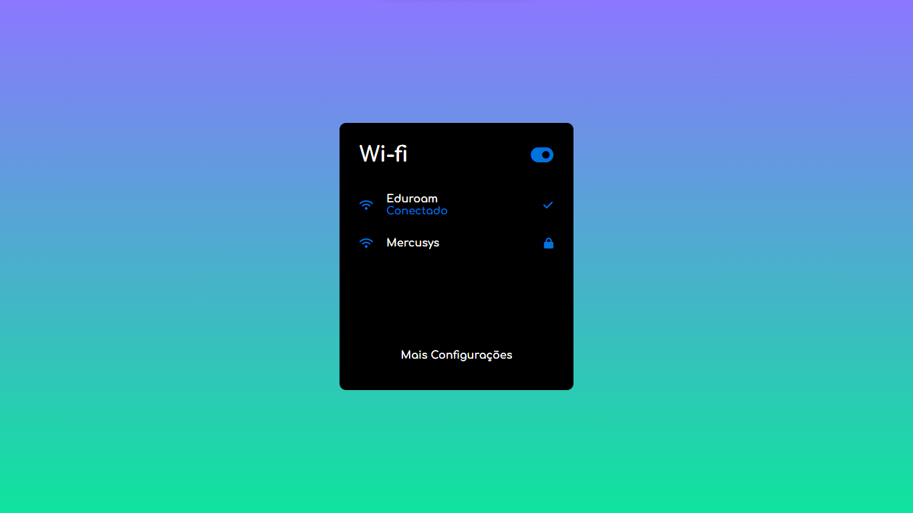

<h1 align="center"> Painel - WI-FI </h1>
 

  

## 🚀 Tecnologias

Esse projeto foi desenvolvido com as seguintes tecnologias:

- HTML e CSS

## 💻 Projeto

Desafio Recriação painel de Wi-fi.

## 💻 Demonstração

https://pamplona-c.github.io/W-fi/

